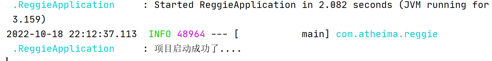
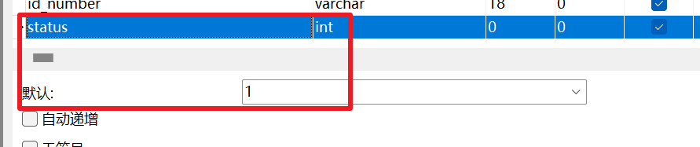
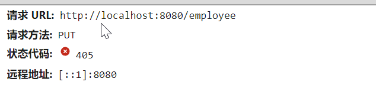
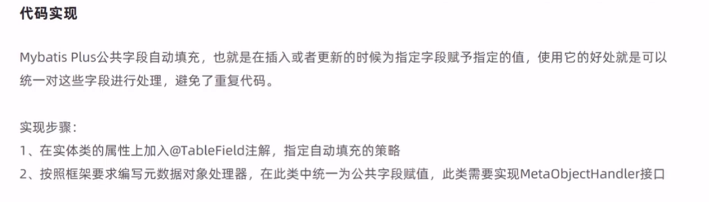
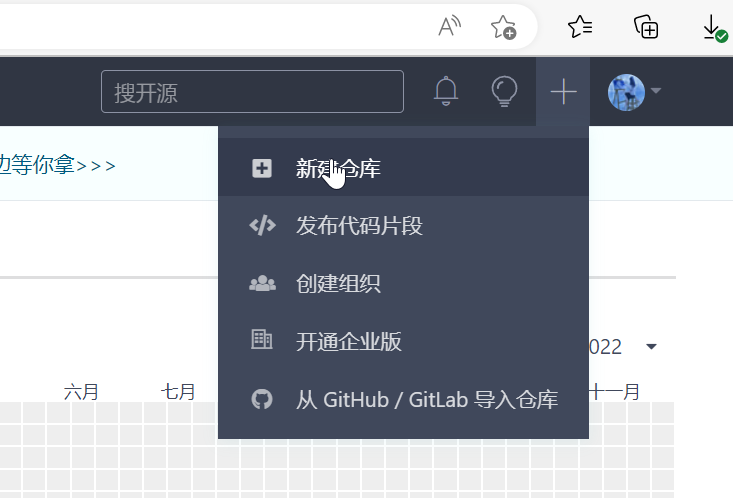

# 前言

这是一个关于瑞吉外卖的项目，从上手到飞起，我值得拥有(doge。

# 开发环境搭建

## 数据库环境的搭建


这边可以直接运行脚本文件，一键导入表。


执行效果如下图所示：


当然，在这里也可以使用命令行的方式一键导入啦，


## Maven项目的搭建

## 具体流程

1.创建maven项目，检查jdk和仓库设置等等；

2.需要的pom文件直接导入，引入一些开发场景所需要的东西；

3.导入配置文件，application.yml

4.java下的包，写启动类，打注解；


5.启动成功



6.导入前端页面，我们主要看后端；由于我们导入了的包不是static/templates，所以springboot项目访问不到，要想访问到，我们就需要做一个静态资源映射，我们去创建一个config，里面写我们的配置类，去继承WebMvcConfigurationSupport,具体如下图：


### 知识点补充1：静态资源映射

静态资源映射

在Springboot项目中，默认静态资源的存放目录为：“classpath:/resources/”, “classpath:/static/”, “classpath:/public/”

而本项目中静态资源存放在backend目录中, 那么这个时候要想访问到静态资源，就需要设置静态资源映射。

创建一个com.itheima.reggie.config.ReggieWebMvcConfig配置类，内容如下:

```java
package com.itheima.reggie.config;

import org.springframework.context.annotation.Configuration;
import org.springframework.web.servlet.config.annotation.ResourceHandlerRegistry;
import org.springframework.web.servlet.config.annotation.WebMvcConfigurer;

//web相关配置
@Configuration
public class ReggieWebMvcConfig implements WebMvcConfigurer {
    //设置静态资源映射
    public void addResourceHandlers(ResourceHandlerRegistry registry) {
        //当访问请求是/backend/**时,去classpath:/backend/寻找对应资源
        registry.addResourceHandler("/backend/**").addResourceLocations("classpath:/backend/");
    }
}
```


### 知识点补充2 ：有关数据源和连接池

数据源：


　　从接触DBMS开始就在用数据源（DataSource），它其中很重要的一个作用就是可以管理Connection，管理的方式也就是经常听到的ConnectionPool。它的管理其实就是对DriverManager获取Connection进行了包装。

　　下面就首先看看用DataSource来取代DriverManager来获取Connection的好处：

　　一般DataSource内部会用一个连接池来缓存Connection，这样获得Connection速度很快，可以大幅度提高数据库的访问速度；通过它获得的Connection都是已经被包裹过的（不是驱动原来的连接），他的close方法已经被修改（并不是真正的关闭）。我们只需和DataSource打交道，不会直接访问连接池。

 

连接池：


　　前面博客讲了,操作数据库的一般步骤:

　　　1.注册驱动

　　　2.建立连接

　　　3.创建执行sql语句的对象

　　　4.执行语句

　　　5.处理执行结果

　　　6.释放资源

　　上面的过程其实就是客户端与DB服务器交互的过程。这个过程就像两个人隔着一条河想要交流一样,其中最费时间的莫过于属搭桥的过程了。上面第二步“建立连接”的过程也就是搭桥的过程了。

　　所以，创建Connection就相当于建一座桥，是数据库操作中最耗时的。所以用完以后就关掉是很浪费的。现在，创建完以后将它放到集合中（arrayList或linkList），用的时候从集合中取，用完了还放回集合中，这样连接就可以复用了。就是用一个集合容器来缓存Connection对象。

　　上面说的集合其实就是连接池了，连接池可以理解成一个能够存放Connection的Collection,有两种形式，即arrayList或linkList。arrayList实际为一个数组，访问速度很快；linkList为一个链表，增、删速度比较快。而连接池中的Connection需要频繁的增删，所以采用linkList来作为Connection对象的容器集合。

　　下面就用代码模拟一个DataSource内部的连接池：

 * ```java
    import java.sql.Connection;
    import java.sql.DriverManager;
    import java.sql.SQLException;
    import java.util.LinkedList;
    
    /**
    
    - @author-zhipeng
      */
      public class MyDataSource {
      private static String url = "jdbc:mysql://localhost:3306/jdbc";
      private static String user = "root";
      private static String password = "";
    
      private static int initCount = 5;
      private static int maxCount = 10;
      private int currentCount = 0;
    
      //创建一个LinkedList作为Connection的容器
      LinkedList<Connection> connectionsPool = new LinkedList<Connection>();
      //初始，创建5个Connection对象放到LinkedList中，用的时候从链表头部取，不用了放到尾部
      public MyDataSource() {
      	try {
      		for (int i = 0; i < initCount; i++) {
      			this.connectionsPool.addLast(this.createConnection());
      			this.currentCount++;
      		}
      	} catch (SQLException e) {
      		throw new ExceptionInInitializerError(e);
      	}
      }
    
      //创建连接时就调用这个方法--从Connection链表容器头部取一个
      public Connection getConnection() throws SQLException {
      	//枷锁-针对并发操作
      	synchronized (connectionsPool) {
      		//如果连接池（实际为LinkList）中还有Connection对象则取出一个
      		if (this.connectionsPool.size() > 0)
      			return this.connectionsPool.removeFirst();
      		//如果连接池没有（初始为5个）Connection对象，而请求连接数小于最大连接数，则创建一个新的Connection
      		if (this.currentCount < maxCount) {
      			this.currentCount++;
      			return this.createConnection();
      		}
      		//否则抛出异常，超过最大连接数，没有连接可用
      		throw new SQLException("已没有链接");
      	}
      }
      //关闭连接时就调用这个方法--不是真正的释放连接，而是放到从Connection链表容器的尾部
      public void free(Connection conn) {
      	this.connectionsPool.addLast(conn);
      }
      //创建Connection的根代码
      private Connection createConnection() throws SQLException {
      	return DriverManager.getConnection(url, user, password);
      }
      }
    ```

    

　　从上面的代码实现可知，如果超过Connection Pool的最大连接数（10个）则必然会因没有连接可以使用而抛异常，下面就用代码实验一下:

 *  * ```java
        /**
        
        - @author-zhipeng
          */
          public class TestConnectionPool {
        
          private static DataSource myDataSource = null;
          /**
        
          - 循环创建11个Connection，期间都不释放（关闭）
            */
            public static void main(String[] args) throws Exception {
        
            for (int i = 0; i < 11; i++) {
            	Connection conn = myDataSource.getConnection();
            	System.out.println(conn);
            	//JdbcUtils.free(null, null, conn);
            }
            }
            }
        ```

　　然后运行，就会发现，当创建第11个的时候就会抛出异常：

　　这也验证了我们上面的实现。当然还可以进行一系列其它的测试，比如创建五个再释放一个，然后再创建一个，这是你就会发现，Connection Pool的“队列”结构。

 

# 登录功能的实现

1.需求分析；

2.开发代码；

3.运行测试；

## 实现

1.导入实体类，employee，

2.创建一些具体的包，controller，service（以及Impl包），mapper，

3.对刚才那些包进行一个具体结构的搭建. 首先是controller这一层，其实不用多说；service层分为两部分，一个是实现类，一个是接口，实现类里面实现了我们写的接口（这个接口还继承了Iservice接口），但是考虑到要写那么多的实现类，所以springboot贴心的为我们准备了一个实现类（ServiceImpl），我们只需要继承即可，再到mapper层，我们写了一个接口，这个东西继承了BaseMapper接口。

4.导入我们的R类，通用返回结果，服务器返回的数据最终会封装成此对象；

5.编写controller中的具体逻辑，如下所示

```java
package com.atheima.reggie.controller;

import com.atheima.reggie.common.R;
import com.atheima.reggie.entity.Employee;
import com.atheima.reggie.service.EmployeeService;
import com.baomidou.mybatisplus.core.conditions.query.LambdaQueryWrapper;
import lombok.extern.slf4j.Slf4j;
import org.springframework.beans.factory.annotation.Autowired;
import org.springframework.util.DigestUtils;
import org.springframework.web.bind.annotation.RequestBody;
import org.springframework.web.bind.annotation.RequestMapping;
import org.springframework.web.bind.annotation.RestController;

import javax.servlet.http.HttpServletRequest;

@Slf4j
@RestController
@RequestMapping("/employee")
public class EmployeeController {
    @Autowired
    EmployeeService employeeService;
    @PostMapping("/login")  //第一次忘记写了
    public R<Employee> getEmployee(HttpServletRequest request, @RequestBody Employee employee){
        //1.对用户输入的密码进行加密
        String password = employee.getPassword();
        String s = DigestUtils.md5DigestAsHex(password.getBytes());
        password = s;
        //2.根据用户的名称，在数据库中查询
        LambdaQueryWrapper<Employee> wrapper = new LambdaQueryWrapper<>();
        wrapper.eq(Employee::getUsername,employee.getUsername());
        Employee one = employeeService.getOne(wrapper);
        //3.返回结果为null，没查到的话
        if (one==null) {
            return R.error("登录失败");
        }
        //4.密码比对
        if (!one.getPassword().equals(password)){
            return R.error("登录失败");
        }
        //5.查看登录的状态，是否被禁用
        if (one.getStatus()==0) {
            return R.error("账号已被禁用");
        }
        //6.登录成功，将用户id 存入session，并返回登录成功的结果
        request.getSession().setAttribute("employee",one.getId());
        return R.success(one);
    }

}

```

## 1登录功能中遇到的重难点


第一处，

前端传过来的name和password封装到了employee中，主要就是使用`@RequestBody`来把请求的请求体中的参数自动转化成实体属性，Json在login.html里面就已经写好了，**@RequestBody接受的是一个json格式的字符串，一定是一个字符串** 。

JSON 是一种轻量级的数据交换格式，它是基于 JavaScript 的一个子集，采用完全独立于编程语言的格式来表示数据，可以跨语言、跨平台使用。简洁清晰的层次结构使得 JSON 逐渐替代了 XML，成为了最理想的数据交换格式，广泛应用于 Web 开发领域。 


第二处,

引言：MD5算法的全称是“消息摘要算法”（Message-Digest Algorithm version.5），它是当前公认的强度最高的加密算法。出现在MD5之前的是MD2和MD4，间隔分别只有一年。虽然三者的算法结构多少有点相似，但是由于MD2诞生于8位计算机的时代，因此它的设计与后来出现的MD4、MD5完全不同，因此不能进行简单的替代。然而，无论是MD2、MD4还是MD5，它们都是在获得一个随机长度信息的基础上产生一个128位信息摘要的算法。MD5将任意长度的"字节串"变换成一个128bit的大整数，并且它是一个不可逆的字符串变换算法，换句话说就是，即使你看到源程序和算法描述，也无法将一个MD5的值变换回原始的字符串，从数学原理上说，是因为原始的字符串有无穷多个，这有点象不存在反函数的数学函数。

**其最经典的应用场景就是用户密码的加密，在很多操作系统中，用户的密码是以MD5值（或类似的其它算法）的方式保存的，用户Login的时候，系统是把用户输入的密码计算成MD5值，然后再去和数据库中保存的MD5值进行比较，而系统并不"知道"用户的密码是什么，大大提高了密码的安全性** .

- **getBytes():** 使用平台的默认字符集将字符串编码为 byte 序列，并将结果存储到一个新的 byte 数组中。

   byte，即字节，由8位的[二进制](https://so.csdn.net/so/search?q=%E4%BA%8C%E8%BF%9B%E5%88%B6&spm=1001.2101.3001.7020)组成。在Java中，byte类型的数据是8位带符号的二进制数。

   在计算机中，8位带符号二进制数的取值范围是[-128, 127]，所以在Java中，byte类型的取值范围也是[-128,              127]。


第三，四，五处：属于mybatis-plus中的内容。


第六处：记好写法；


# 后台退出功能开发

在controller里面写一个退出逻辑，1.删除session中的用户id，返回一个删除成功结果。


# 登录功能的完善_过滤器

首先得有一个filter包，建一个类，类里面记得写@WebFilter，实现一个接口Filter，实现里面的方法doFilter（），需要注意的是，我们的index.html是可以出现的，只是里面的员工信息是需要处理的，这里就用到了拦截器机制，代码如下：

```java
package com.atheima.reggie.filter;

import com.alibaba.fastjson.JSON;
import com.atheima.reggie.common.R;
import lombok.extern.slf4j.Slf4j;
import org.springframework.util.AntPathMatcher;

import javax.servlet.*;
import javax.servlet.annotation.WebFilter;
import javax.servlet.http.HttpServletRequest;
import javax.servlet.http.HttpServletResponse;
import java.io.IOException;
@Slf4j
@WebFilter(filterName = "loginCheckFilter",urlPatterns = "/*")
public class LoginCheckFilter implements Filter {
    //用来匹配两个路径的，是否相等
    public static final AntPathMatcher PATH_MATCHER = new AntPathMatcher();

    @Override
    public void doFilter(ServletRequest servletRequest, ServletResponse servletResponse, FilterChain filterChain) throws IOException, ServletException {
        HttpServletRequest request = (HttpServletRequest)servletRequest;
        HttpServletResponse response = (HttpServletResponse)servletResponse;
        //获取当前路径
        String requestURI = request.getRequestURI();
        //不需要处理的路径
        String urls[] = new String[]{"/backend/**","/front/**","/employee/login","/employee/logout"};
        //判断是否需要处理
        log.info("当前请求路径{}",request.getRequestURI());
        if(check(urls,requestURI)){
            log.info("当前路径{}不需要处理",request.getRequestURI());
            filterChain.doFilter(request,response);
            return;
        }
        //需要处理，是否登录
        log.info("当前路径{}需要处理",request.getRequestURI());
        if (request.getSession().getAttribute("employee") != null){
            filterChain.doFilter(request,response);
            return;
        }
        response.getWriter().write(JSON.toJSONString(R.error("NOTLOGIN")));
    }

    //封装方法，判断是否不需要检查这个路径
    public boolean check(String urls[],String requestURI){
        for (String url : urls) {
           if (PATH_MATCHER.match(url,requestURI)){
               return true;
           }
        }
        return false;

    }
}

```


## 知识点回顾2 过滤器和拦截器

一、二者理解
过滤器（Filter）
过滤器，是在java web中将你传入的request、response提前过滤掉一些信息，或者提前设置一些参数。然后再传入Servlet或Struts2的 action进行业务逻辑处理。比如过滤掉非法url（不是login.do的地址请求，如果用户没有登陆都过滤掉），或者在传入Servlet或Struts2的action前统一设置字符集，或者去除掉一些非法字符。

拦截器（Interceptor）
拦截器，是面向切面编程（AOP，Aspect Oriented Program）的。就是在你的Service或者一个方法前调用一个方法，或者在方法后调用一个方法。比如动态代理就是拦截器的简单实现，在你调用方法前打印出字符串（或者做其它业务逻辑的操作），也可以在你调用方法后打印出字符串，甚至在你抛出异常的时候做业务逻辑的操作。

通俗理解：
（1）过滤器（Filter）：当你有一堆东西的时候，你只希望选择符合你要求的某一些东西。定义这些要求的工具，就是过滤器。（理解：就是一堆字母中取一个B）
（2）拦截器（Interceptor）：在一个流程正在进行的时候，你希望干预它的进展，甚至终止它进行，这是拦截器做的事情。（理解：就是一堆字母中，干预它，通过验证的少点，顺便干点别的东西）

二、拦截器与过滤器的区别
区别：
①：拦截器是基于java的反射机制的，而过滤器是基于函数的回调。
②：拦截器不依赖于servlet容器，而过滤器依赖于servlet容器。
③：拦截器只对action请求起作用，而过滤器则可以对几乎所有的请求起作用。
④：拦截器可以访问action上下文、值、栈里面的对象，而过滤器不可以。
⑤：在action的生命周期中，拦截器可以多次被调用，而过滤器只能在容器初始化时被调用一次。
⑥：拦截器可以获取IOC容器中的各个bean，而过滤器不行，这点很重要，在拦截器里注入一个service，可以调用业务逻辑。

三、拦截器与过滤器的触发时机
拦截器与过滤器触发时机不一样
过滤器是在请求进入容器后，但请求进入servlet之前进行预处理的。请求结束返回也是，是在servlet处理完后，返回给前端之前。

过滤器包裹servlet，servlet包裹住拦截器

四、使用场景
SpringMVC的处理器拦截器类似于Servlet开发中的过滤器Filter，用于对处理器进行预处理和后处理。

1、日志记录：记录请求信息的日志，以便进行信息监控、信息统计、计算PV（Page View）等。
2、权限检查：如登录检测，进入处理器检测检测是否登录，如果没有直接返回到登录页面；
3、性能监控：有时候系统在某段时间莫名其妙的慢，可以通过拦截器在进入处理器之前记录开始时间，在处理完后记录结束时间，从而得到该请求的处理时间（如果有反向代理，如apache可以自动记录）；
4、通用行为：读取cookie得到用户信息并将用户对象放入请求，从而方便后续流程使用，还有如提取Locale、Theme信息等，只要是多个处理器都需要的即可使用拦截器实现。
5、OpenSessionInView：如hibernate，在进入处理器打开Session，在完成后关闭Session。

五、图解

 


# 新增员工


1.查看数据库里面的employee表，发现我们的username字段，加入了unique的约束，因为username是唯一的，用户登录的一个标识，所以是唯一的。



2.status的默认值是1，代表当前用户登录状态正常，没有被禁用。

：：这个部分的主要功能就是向其中插入员工信息。


这个是点击新增员工后的界面，看出来是发送了ajax请求，因为我们的controller没有相应的处理逻辑，所以404，我们提交的信息也转成了json字符串的形式。


所以现在要做的事情就是编写controller的处理逻辑，包括service层进而到mapper层；

标注：**这个 <T> T 表示的是返回值T是**泛型，T是一个占位符，用来告诉编译器，这个东西先给我留着，等我编译的时候，告诉你。 


#  员工信息的分页查询

1.首先创建一个config来配置分页插件；

2.然后在controller层开始写控制层逻辑；

```java
/**
     * 员工信息的分页查询
     * @param page
     * @param pageSize
     * @param name
     * @return
     */
    @GetMapping("/page")
    public R<Page> page(int page,int pageSize,String name){
        log.info("page={},pageSize={},name={}",page,pageSize,name);
        //创建分页构造器
        Page pageInfo = new Page(page,pageSize);
        //创建条件构造器
        LambdaQueryWrapper<Employee> lambdaQueryWrapper = new LambdaQueryWrapper<>();
        if (name!=null) {
            lambdaQueryWrapper.eq(Employee::getName,name);
        }
        lambdaQueryWrapper.orderByDesc(Employee::getUpdateUser);
        employeeService.page(pageInfo,lambdaQueryWrapper);
        return R.success(pageInfo);
    }
```

# 启用禁用员工账号

页面（前端）已经实现了是否可以看到启用或者禁用员工账号，如果是管理员登录可以看到，普通用户看不到。


1，点击禁用页面会发送一个ajax请求，我们还是需要写controller层到mapper层的逻辑处理




2. 当点击禁用的时候，没有实现功能，但是也没有报错，问题出在我们提交的数据中，js对我们的Long类型（包装类）进行处理的时候，发生了精度丢失，导致我们页面上面的id和我们数据库当中的不一致，相当于没有找到。所以我们把Long类型转换为String类型，js就不会进行处理了。

   


2. 

第一步：到common里面拷贝代码；

```java
package com.atheima.reggie.common;

import com.fasterxml.jackson.databind.DeserializationFeature;
import com.fasterxml.jackson.databind.ObjectMapper;
import com.fasterxml.jackson.databind.module.SimpleModule;
import com.fasterxml.jackson.databind.ser.std.ToStringSerializer;
import com.fasterxml.jackson.datatype.jsr310.deser.LocalDateDeserializer;
import com.fasterxml.jackson.datatype.jsr310.deser.LocalDateTimeDeserializer;
import com.fasterxml.jackson.datatype.jsr310.deser.LocalTimeDeserializer;
import com.fasterxml.jackson.datatype.jsr310.ser.LocalDateSerializer;
import com.fasterxml.jackson.datatype.jsr310.ser.LocalDateTimeSerializer;
import com.fasterxml.jackson.datatype.jsr310.ser.LocalTimeSerializer;
import java.math.BigInteger;
import java.time.LocalDate;
import java.time.LocalDateTime;
import java.time.LocalTime;
import java.time.format.DateTimeFormatter;
import static com.fasterxml.jackson.databind.DeserializationFeature.FAIL_ON_UNKNOWN_PROPERTIES;

/**
 * 对象映射器:基于jackson将Java对象转为json，或者将json转为Java对象
 * 将JSON解析为Java对象的过程称为 [从JSON反序列化Java对象]
 * 从Java对象生成JSON的过程称为 [序列化Java对象到JSON]
 */
public class JacksonObjectMapper extends ObjectMapper {

    public static final String DEFAULT_DATE_FORMAT = "yyyy-MM-dd";
    public static final String DEFAULT_DATE_TIME_FORMAT = "yyyy-MM-dd HH:mm:ss";
    public static final String DEFAULT_TIME_FORMAT = "HH:mm:ss";

    public JacksonObjectMapper() {
        super();
        //收到未知属性时不报异常
        this.configure(FAIL_ON_UNKNOWN_PROPERTIES, false);

        //反序列化时，属性不存在的兼容处理
        this.getDeserializationConfig().withoutFeatures(DeserializationFeature.FAIL_ON_UNKNOWN_PROPERTIES);


        SimpleModule simpleModule = new SimpleModule()
                .addDeserializer(LocalDateTime.class, new LocalDateTimeDeserializer(DateTimeFormatter.ofPattern(DEFAULT_DATE_TIME_FORMAT)))
                .addDeserializer(LocalDate.class, new LocalDateDeserializer(DateTimeFormatter.ofPattern(DEFAULT_DATE_FORMAT)))
                .addDeserializer(LocalTime.class, new LocalTimeDeserializer(DateTimeFormatter.ofPattern(DEFAULT_TIME_FORMAT)))

                .addSerializer(BigInteger.class, ToStringSerializer.instance)
                .addSerializer(Long.class, ToStringSerializer.instance)
                .addSerializer(LocalDateTime.class, new LocalDateTimeSerializer(DateTimeFormatter.ofPattern(DEFAULT_DATE_TIME_FORMAT)))
                .addSerializer(LocalDate.class, new LocalDateSerializer(DateTimeFormatter.ofPattern(DEFAULT_DATE_FORMAT)))
                .addSerializer(LocalTime.class, new LocalTimeSerializer(DateTimeFormatter.ofPattern(DEFAULT_TIME_FORMAT)));

           //注册功能模块 例如，可以添加自定义序列化器和反序列化器
           this.registerModule(simpleModule);
    }
}

```

第二步： 到config里面设置一个消息转换器；

```java
 /**
     * 扩展mvc的消息转换器
     * @param converters
     */
    @Override
    protected void extendMessageConverters(List<HttpMessageConverter<?>> converters) {
        log.info("扩展消息转换器");
        //创建新的消息转换器
        MappingJackson2HttpMessageConverter mappingJackson2HttpMessageConverter = new MappingJackson2HttpMessageConverter();
        mappingJackson2HttpMessageConverter.setObjectMapper(new JacksonObjectMapper());
        converters.add(0,mappingJackson2HttpMessageConverter);
    }
```

然后发生效果，完成该功能；

# 编辑员工信息


```java
@GetMapping("/{id}")
    public R<Employee> getById(@PathVariable Long id){
    Employee byId = employeeService.getById(id);
    if (byId!=null){
        return R.success(byId);
    }
   return R.error("没有查询到");
}

```

# 分类管理

自动填充公共字段





1.

```java
@TableField(fill = FieldFill.INSERT)
    private LocalDateTime createTime;
    @TableField(fill = FieldFill.INSERT_UPDATE)
    private LocalDateTime updateTime;

    @TableField(fill = FieldFill.INSERT)
    private Long createUser;

    @TableField(fill = FieldFill.INSERT_UPDATE)
    private Long updateUser;

```

2.

```java
/**
 * 自定义元数据对象处理器
 */
@Component
@Slf4j
public class MyMetaObjectHandler implements MetaObjectHandler {
    @Override
    public void insertFill(MetaObject metaObject) {
    metaObject.setValue("createTime", LocalDateTime.now());
        metaObject.setValue("updateTime", LocalDateTime.now());
        metaObject.setValue("createUser", new Long(1));
        metaObject.setValue("updateUser", new Long(1));
    }

```


创建一个类BaseContext来写固定的方法set/get方法，存放/获取当前线程上面的id，用的时候直接调用该类当中的方法即可，前面写的公共字段填充的”写死“的部分，就可以用BaseContext.set()/get()来获取当前的操作人的id。

```java
/**
 * 基于ThreadLocal封装工具类，来获取当前用户的id
 */
public class BaseContext {
    private static ThreadLocal<Long> threadLocal = new ThreadLocal<>();

    public static void set(Long id){
        threadLocal.set(id);
    }

    public static Long get(){
        return threadLocal.get();
    }
}
```

# 新增菜品

先搭建好三层结构，在Controller中写好对应逻辑就好

# 删除菜品

在Controller中写好对应逻辑就好，这是一种比较简单的删除；

但是涉及到一些复杂的逻辑，比如说如果该菜品分类关联了其他套餐等等，就提示用户不能删除；

这个时候

1.我们先导入套餐和菜品的实体类；

2.一般来说，导入一个实体类，对应这我们要写一些对应的三层结构，所以Mapper，Service，Controller写好；

**发现一个问题：**


**正解：**

 这个问题不必深究，这是java开发团队开发过程中，制定的一个语法规则。 因为考虑到java只能单继承、多实现的原则，所以先继承，后实现，实现可以实现多个接口写在后边比较直观。  

3.我们之前写的一个删除逻辑比较简单，没有对当前的菜品分类进行检查，是否关联了相关的菜品或者套菜，现在我们来实现这个功能，首先的想法是去菜品或者套餐表里面去查当前要删除的菜品的唯一标志菜品id字段的数目是不是大于0，如果是就不能删除，这个时候我们就抛出一个业务异常，反之，则返回删除成功。

我们把之前直接调用的Service方法注释掉，然后在Service接口当中写上我们自己的方法，然后到ServiceImpl进行实现。

4.编写我们自定义的一个业务异常costomException，写在common里面；

```java
public class CustomException extends RuntimeException{
    public CustomException(String message){
        super(message);
    }
}
```

5.

```java
@Service
public class CategoryServiceImpl extends ServiceImpl<CategoryMapper, Category> implements CategoryService {
    @Autowired
    DishService dishService;
    @Autowired
    SetmealService setmealService;

    @Override
    public void remove(Long id) {
        LambdaQueryWrapper<Dish> lambdaQueryWrapper = new LambdaQueryWrapper<>();
        lambdaQueryWrapper.eq(Dish::getCategoryId,id);
        int count1 = dishService.count(lambdaQueryWrapper);
        if (count1>0) {
            //抛出业务处理异常
        throw new CustomException("当前菜品关联了该菜品分类");
        }

        LambdaQueryWrapper<Setmeal> lambdaQueryWrapper1 = new LambdaQueryWrapper<>();
        lambdaQueryWrapper1.eq(Setmeal::getCategoryId,id);
        int count = setmealService.count(lambdaQueryWrapper1);
        if (count>0) {
            //抛出一个业务处理异常
            throw new CustomException("当前套餐关联了该菜品分类");
        }
    }
}

```

# 菜品管理

一，文件上传upload

1.


2.文件下载


3.编写相应的处理逻辑Controller


4.去配置文件里面设置一下路径，动态获取存放的路径


5.代码

```java
package com.atheima.reggie.controller;

import com.atheima.reggie.common.R;
import org.springframework.beans.factory.annotation.Value;
import org.springframework.web.bind.annotation.PostMapping;
import org.springframework.web.bind.annotation.PutMapping;
import org.springframework.web.bind.annotation.RequestMapping;
import org.springframework.web.bind.annotation.RestController;
import org.springframework.web.multipart.MultipartFile;

import java.io.File;
import java.io.IOException;
import java.util.UUID;

@RestController
@RequestMapping("/common")

/**
 * 文件上传功能
 */
public class CommonController {
    @Value("reggie.path")
    private String path;
    @PostMapping("/upload")
    //此处的file是一个临时文件，请求消失之后就会不见，我们要把这个文件放到我们的服务器上面
    public R<String> upload(MultipartFile file){
        //此处获取的是上传文件的原始名字，但是为了防止原始的名字有重复，覆盖掉了
        //原来上传的图片，所以这个时候我们使用UUID的方式上传，防止重复
        String originalFilename = file.getOriginalFilename();
        int i = originalFilename.lastIndexOf(".");
        String substring = originalFilename.substring(i);
        //使用 UUID的方式
        String s = UUID.randomUUID().toString();//此时生成的是一串序列，还需要拼接原始文件的后缀suffix
        String fileName = s+substring;
        File dir = new File(path);
        if (!dir.exists()) {
            //目录不存在 就创建该目录
            dir.mkdirs();
        }


        try {
            //将临时文件转存到我们设定的位置
            file.transferTo(new File(path+fileName));
        } catch (IOException e) {
            e.printStackTrace();
        }


        return R.success(fileName);
    }
}

```

注：.substring()方法。


编写程序的过程当中，发现从配置文件读到的路径不对，发现注解不对，变量上面写的@Value里面忘记写{}号了，所以读到的东西一直有问题，改完之后断点追踪发现没什么问题了就。


**文件下载**

1.首先得从浏览器上面找到请求路径，编写对应的Controller

2.参数当中携带了name，就是我们的照片名字，需要一个输入流和一个输出流；

输入流从我们的照片里面去读数据，然后一块块的放到byte数组里面，输出流从数组里面读出来写回浏览器。

```java

    /**
     * 实现文件下载
     * @param name
     * @param response
     */
    @GetMapping("/download")
    public void download(String name, HttpServletResponse response){
       //name是当前从浏览器获取的之前上传的照片名字
        try {
            //创建一个输入流
            FileInputStream inputStream = new FileInputStream(new File(path+fileName));
            //创建一个输出流
            ServletOutputStream outputStream = response.getOutputStream();
            //规定输出的类型
            response.setContentType("image/jpeg");
            //创建一个byte数组
            byte[] bytes = new byte[1024];
            //创建一个长度变量
            int len = 0;
            //循环写出到浏览器当中
            while ((len = inputStream.read(bytes)) != -1){
                outputStream.write(bytes,0,len);
            }
            //关闭流
            outputStream.close();
            inputStream.close();
        } catch (Exception e) {
            e.printStackTrace();
        }
    }
}

```

# 新增菜品

1.菜品的添加界面有一个菜品口味的一项，这个时候我们为DishFlavor创建对应的Mapper和Service以及ServiceImpl，别忘了将菜品口味的视图类导入，对应我们的口味表；

2.创建DishController,相关的菜品口味，菜品管理都在这个中间编写；


先进行一个页面菜品分类的显示；这里编写对应的Controller就行，

```java
 /**
     * 根据条件查询菜品分类数据
     * @param category
     * @return
     */
    @GetMapping("/list")
    public R<List<Category>> list(Category category){
       //创建条件构造器
        LambdaQueryWrapper<Category> lambdaQueryWrapper = new LambdaQueryWrapper<>();
        //添加条件
        lambdaQueryWrapper.eq(category.getType()!=null,Category::getType,category.getType());
        //添加排序条件
        LambdaQueryWrapper<Category> lambdaQueryWrapper1 = lambdaQueryWrapper.orderByDesc(Category::getSort).orderByAsc(Category::getCreateTime);
        List<Category> list = categoryService.list(lambdaQueryWrapper);
        return R.success(list);
    }
```


发送一个请求；


会发现除了flavors这个属性之外，页面返回的json数据我们的Category类型的实体都有，那这个时候我们用什么进行页面参数的接收呢，用DishDto，DTO全称为Data Transfer Object,即数据传输对象，一般用来展示层和服务层之间的数据传输。会发现这个类继承了Dish，并且添加了缺少的那个方法。 


3.由于添加了口味，涉及到两张表，所以不能简单用Service的方法来写了，我们需要自定义方法。

4.定义好之后，需要在方法里面把Category的数据写进去，然后再来看口味表，发现口味表当中的属性，有一个菜品id是我们传过来属性当中没有的，我们就需要特殊的方法将其添加进去然后再变成list；

5.因为涉及两张表，所以我们加入事务控制，在方法上面，别忘了启动类上也需要标注；

```java
 @Autowired
   DishFlavorService dishFlavorService;
    /**
     * 新增菜品，保存口味
     * @param dishDto
     */
    @Transactional
    public void saveWithFlavor(DishDto dishDto) {
        //将基本信息先保存到菜品表当中
        this.save(dishDto);
        //菜品id
        Long categoryId = dishDto.getCategoryId();

        //菜品口味
        List<DishFlavor> flavors = dishDto.getFlavors();
        flavors.stream().map((item) -> {
            item.setDishId(categoryId);
            return item;
        }).collect(Collectors.toList());

        dishFlavorService.saveBatch(flavors);
    }
}
```

# 菜品信息分页查询

1.比起之前的分页，多了一些图片以及字段；


编写分页查询之后的效果，由于我们返回的数据里面没有菜品分类的名称，只有id，不能匹配上，所以最终没有该字段的显示，我们现在需要解决这个问题；

2.所以当前页面泛型不满足条件，我们之前写了一个页面的dto，想起来倒是可以用一用

```java
 @GetMapping("/page")
    public R<Page> page(int page,int pageSize,String name){

       Page<Dish> pageInfo = new Page<>(page,pageSize);
       Page<DishDto> dishDtoPage = new Page<>();

       
       LambdaQueryWrapper<Dish> queryWrapper = new LambdaQueryWrapper<>();
      
       queryWrapper.like(name != null,Dish::getName,name);
       
       queryWrapper.orderByDesc(Dish::getUpdateTime);

     
       dishService.page(pageInfo,queryWrapper);

    
       BeanUtils.copyProperties(pageInfo,dishDtoPage,"records");

       List<Dish> records = pageInfo.getRecords();

       List<DishDto> list = records.stream().map((item) -> {
           DishDto dishDto = new DishDto();

           BeanUtils.copyProperties(item,dishDto);

           Long categoryId = item.getCategoryId();
          
           Category category = categoryService.getById(categoryId);

           if(category != null){
               String categoryName = category.getName();
               dishDto.setCategoryName(categoryName);
           }
           return dishDto;
       }).collect(Collectors.toList());

       dishDtoPage.setRecords(list);

       return R.success(dishDtoPage);
   }
```

# 修改菜品

1.根据修改的某个菜品的id修改菜品，将id传到控制层，然后根据id去回显数据；

2.查询两行表，由于包含口味，所以查询起来稍微麻烦一点。

```java
/**
     * 根据id获取信息
     * @param id
     * @return
     */
    @Override
    public DishDto getWithFlavors(Long id) {
        Dish byId = this.getById(id);
        DishDto dishDto = new DishDto();
        BeanUtils.copyProperties(byId,dishDto);
        //条件查询菜品口味
        LambdaQueryWrapper<DishFlavor> lambdaQueryWrapper = new LambdaQueryWrapper<>();
        lambdaQueryWrapper.eq(DishFlavor::getId, id);
        List<DishFlavor> list = dishFlavorService.list(lambdaQueryWrapper);
        dishDto.setFlavors(list);
        return dishDto;
    }
```

3.鉴于和添加菜品的过程相似，只做一个代码演示：


# 套餐管理

# 新增套餐


涉及到两张表，如上图所示：
1.搭建与套餐有关的（套餐表，套餐菜品关系表）三层架子，导入实体类；


2.观察当点击添加菜品的时候，页面已经根据type（1/2代表菜品还是套餐）之前写过的category查出来对应的菜品分类了，只不过没有对应的详细菜品，查看请求的url,可以发现传过来一个categoryId，我们在对应的dishController中查询对应的list<Dish>就可以了，然后返回给页面。

3.点击保存按钮，将页面套餐的数据以json的形式提交，

4.编写对应的Service层；

```java
 SetmealDishService setmealDishService;
    /**
     * 根据传过来的数据 保存到相应的表中
     * @return
     */
    @Transactional
    public R<String> saveWithDishes(SetmealDto setmealDto) {
       this.save(setmealDto);
        List<SetmealDish> setmealDishes = setmealDto.getSetmealDishes();
        setmealDishes.stream().map((item)->{
            item.setSetmealId(setmealDto.getId());
            return item;
        }).collect(Collectors.toList());

        setmealDishService.saveBatch(setmealDishes);
        return R.success("保存成功");
    }
```

# 套餐分页查询

1.和前面做过的类似就，分页查询，但是由于查询到的东西缺少套餐分类，只有套餐id的显示，匹配不到，故不进行显示，因此还要用到对象拷贝；

```java
 /**
     * 分页查询
     * @param page
     * @param pageSize
     * @param name
     * @return
     */
    @GetMapping("/page")
    public R<Page> page(int page, int pageSize, String name){
        //创建分页构造器
        Page<Setmeal> pageInfo = new Page<>(page,pageSize);
        //创建对象
        SetmealDto setmealDto = new SetmealDto();
        Page<SetmealDto> pageDto = new Page<>();
        //创建条件选择器
        LambdaQueryWrapper<Setmeal> lambdaQueryWrapper = new LambdaQueryWrapper<>();
        //条件查询
        lambdaQueryWrapper.like(name!=null,Setmeal::getName,name);
        lambdaQueryWrapper.orderByDesc(Setmeal::getCreateTime);
        setmealService.page(pageInfo,lambdaQueryWrapper);
        //对象拷贝 除了records属性
        BeanUtils.copyProperties(pageInfo,pageDto,"records");
        List<Setmeal> records = pageInfo.getRecords();
        List<SetmealDto> collect = records.stream().map((item) -> {
            BeanUtils.copyProperties(item, setmealDto);
            Long categoryId = item.getCategoryId();
            Category byId = categoryService.getById(categoryId);
            String name1 = byId.getName();
            setmealDto.setCategoryName(name1);
            return setmealDto;
        }).collect(Collectors.toList());
        pageDto.setRecords(collect);
        return R.success(pageDto);
    }
```

# 删除套餐

该功能和之前写的逻辑出入并不多，大概讲一下逻辑，不仅仅是一张表，涉及两张表，套餐表和套餐菜品关系表，因此需要自己手写一个方法去处理，就好了。

# 短信发送


1.注册账号

2.

点击控制台

3.导入maven坐标


4.代码开发 调用api（从官网直接复制）

```java
import com.aliyuncs.DefaultAcsClient;
import com.aliyuncs.IAcsClient;
import com.aliyuncs.exceptions.ClientException;
import com.aliyuncs.exceptions.ServerException;
import com.aliyuncs.profile.DefaultProfile;
import com.google.gson.Gson;
import java.util.*;
import com.aliyuncs.dysmsapi.model.v20170525.*;

public class SendSms {

    public static void main(String[] args) {
        DefaultProfile profile = DefaultProfile.getProfile("cn-beijing", "<your-access-key-id>", "<your-access-key-secret>");
        /** use STS Token
        DefaultProfile profile = DefaultProfile.getProfile(
            "<your-region-id>",           // The region ID
            "<your-access-key-id>",       // The AccessKey ID of the RAM account
            "<your-access-key-secret>",   // The AccessKey Secret of the RAM account
            "<your-sts-token>");          // STS Token
        **/
        IAcsClient client = new DefaultAcsClient(profile);

        SendSmsRequest request = new SendSmsRequest();
        request.setPhoneNumbers("1368846****");//接收短信的手机号码
        request.setSignName("阿里云");//短信签名名称
        request.setTemplateCode("SMS_20933****");//短信模板CODE
        request.setTemplateParam("张三");//短信模板变量对应的实际值

        try {
            SendSmsResponse response = client.getAcsResponse(request);
            System.out.println(new Gson().toJson(response));
        } catch (ServerException e) {
            e.printStackTrace();
        } catch (ClientException e) {
            System.out.println("ErrCode:" + e.getErrCode());
            System.out.println("ErrMsg:" + e.getErrMsg());
            System.out.println("RequestId:" + e.getRequestId());
        }

    }
}
```


封装成一个工具类，后期来使用；

# 手机验证码登录

1.导入maven坐标

2.导入User和一些实体类

3.创建三层结构

4.修改过滤器


5.

6.


```java
/**
     * 发送手机验证码
     * @param user
     * @return
     */
    @PostMapping("/sendMsg")
    public R<String> sendMsg(@RequestBody User user, HttpSession session){
         //获取手机号
        String phone = user.getPhone();
        if (StringUtils.isEmpty(phone)){
            //利用工具类ValidateCode 生成四位验证码
           String integer = ValidateCodeUtils.generateValidateCode(4).toString();
           log.info("生成的验证码：{}",integer);
            //调用阿里云提供的接口API发送短信
            SMSUtils.sendMessage("橙的陈子","",phone,integer);
            //需要将生成的验证码保存到session当中
             session.setAttribute(phone,integer);
             return R.success("手机验证码发送成功");
        }
             return R.error("手机验证码发送失败");
    }
```

7.处理登录逻辑：

//失败放在分支里面，成功放在分支外面，可以防止嵌套分支，编程习惯


# 菜品展示

1.导入地址薄相关代码


# 2.菜品展示代码

# 3.购物车模块

# 4.用户下单模块

# Git


可以做以上的事情；


2.下载


3.


# Git代码托管服务


3.创建仓库



4.邀请其他成员


5.Git常用命令

5.1 设置用户名和email


5.2获取git仓库


5.3 

第一种：在本地建立一个仓库，这是第一种方式，新建一个目录，然后右键选择gitbase 输入git init就可以实现git初始化建立仓库；

第二种：这种方式也是最常用的一种方式，

（输入错的话，在控制面板/用户账户/凭据管理器/Windows 凭据/编辑gitee凭据，下修改账户密码;）

将自己在gitee建立好的仓库地址输入到控制台，git clone +地址，然后输入自己的账号密码，账号：chengziiii；密码：1210comeon!!!;


git常用命令


大致过程如下：

1.在.git同级目录之下创建测试的文件；

2.打开控制台，git add user.java 将文件加入到暂存区

3.git commit --m "消息" user.java

4.git reset user.java 从暂存区取消

5.git  log打印日志

6.如果想恢复到某个版本git reset --hard 版本控制号

7.git status 查看文件状态；


需要注意的是，每次修改之后的文件，都需要重新放到暂存区，而后进行提交；

现在我们需要将本地仓库和远程仓库进行一个关联，git remove /git remove -v查看远程仓库的状态，前提是目前是在一个远程仓库当中，如果是本地仓库，则不能这么做；

git remove add <shortname 一般是origin> url,这个操作一般是对本地仓库进行操作的，让本地仓库和远程仓库建立联系；

git push <源名称> <分支> //////git push origin master 这个操作之前，我们需要将文件放到仓库之中，也就是要commit


通过这个可以将一个空仓库建立一个分支，master；然后提交的内容都在这里，这个分支有url，我们可以在建立分之后，git clone url 相当于将本地的一个仓库关联上了这个有readme的远程仓库，然后后期可以上传文件；

从远程仓库拉取，git pull origin master,一般是用于多人协作；

另外还要注意一种情况：


# Git分支操作


git branch 查看本地分支，一般情况下，建立一个仓库的时候会默认一个分支master；

git branch -r  查看远程分支，origin/master origin仓库之下的master分支，一般情况下，建立一个远程仓库的时候会默认一个分支master；

git branch -a 显示所有分支，上图绿色的是本地的master 下面的是远程的master；

git branch +name 这个时候可以创建一个以name为名的branch，注意到master是绿色显示，其他新建的分支还是灰色字体，因为绿色是提示我们当前是在哪一个分支上面；

git checkout  +name 切换分支；

git push origin master/其他分支的名字，将本地仓库推送到远程仓库；

注意一点，不同的分支在本地我们可以看到不同的目录结构，这些都取决于你写的目录结构，平行宇宙了属于是，还需要留意的是你把东西commit了，但是没有push，是不会推送的，写到这里时候你出错了；

git merge +name(分支名字)      先切换到你要合并到的那个分支，比如说master ，然后写上例如git merge b1的字样即可，此时只是在本地进行了合并，要想上传到远程仓库，还需要push等操作；

# Git的标签操作

类似于快照，在某个时间点记录下当前的状态，比如分支的v1.o v2.0等；


git checkout -b b1.0 (新建一个分支名称，用于存放之前的标签状态下的状态) v1.0

检出标签其实相当于回退到某个历史版本；


# 在idea中使用Git


1.首先配置Git在idea中；

2.在本地初始化一个项目；


本地创建仓库的时候，若将一个项目作为一个仓库，里面的文件的同级会生成一个.git文件，而且会生成一些git按钮，相当于在黑框框里面的git init；

3.从远程克隆仓库；


输入用户名密码之后，选择我们将要存放的位置之后，就可以了；

# 在idea中使用git本地仓库操作

这一部分笔记省略，多是可视化软件的操作，稍微熟悉一下就好，毕竟底层代码了解了，其他的都是换汤不换药，再次说一句，idea太强了，什么破解版！学习版！


# Linux的一些基本操作

之前学过linux，由于好长时间不用，很多东西都忘记了，所以就当是复习吧；


1.常用的一些命令：

ls 列出当前有哪些东西

touch 新建一个文件

ls -la  -a表示列出所有，-l表示列的详细一点

rm (-f)  加上-f就是直接删了，不需要询问

cat  浏览一下某文件有哪些内容

vim  编辑某文件

cd  进入某个目录

pwd 显示当前所在的位置

mkdir 创建文件夹 mkdir -p 1/2/3 的意思是一下可以创建多层目录，1/2/3 三层目录这样子；

2.文件目录操作命令more：

more命令是一页一页的看，不是像cat一样直接就显示一大堆，

比如more 1.txt 显示之后，

按空格键 显示下一页；

按回车键 显示下一行；

按b 回退到上一页；

按q取消more模式

3.文件目录操作命令tail：

tail用于显示文件的最后几行，一般经常用来查日志；

tail -2 1.txt 查一下1.txt的最后两行；

tail 1.txt 默认显示后10行

tail -f 1.txt 动态显示，即当文件中新增一些东西的时候会将新增的内容打印出来，有点像控制台输出；

4.文件目录操作命令rmdir：rmdir只能删除空文件夹，所以这个命令用的也比较少；

rm -r 文件夹/文件 这个命令是递归删除文件夹或者是文件 的，rm -f 直接删除文件夹/文件

所以一般来说，rm -rf 用的应该比较多；

5，拷贝移动命令

如果说只是拷贝文件的话，就用cp 源文件 目标文件 ；如果想拷贝到当前目录，由于一个目录的名字相同并不好，所以改一下名字，这个时候就是cp 1.txt  ./2.txt 的意思就是将当前目录的1.txt复制到当前目录，并且改名为2.txt;

如果说拷贝的是一个文件夹，这时候就要加上-f了【 cp -r 源目录 目标目录】，这种会把我们的源目录以及源目录下的文件都拷贝过去；如果只想拷贝当前目录下的子文件，则用一下命令【cp -r 源目录/* 目标目录】


mv hello.txt hi.txt 意思是将hello.txt 改名为hi.txt

mv hi.txt itheima / 将文件hi.txt移动到itheima里面

.......

写了半天发现上面有注解，又是没有脑子的一天；

好了，总的来说这个命令不是移动文件或者文件夹就是改名子，所以说这个命令也挺强大的，可以只能识别，不像我，什么都看不清呜呜；

6.打包压缩命令：


首先明确两件事，看到.tar结尾的就知道这是个打包文件，看到.tar.gz就应该知道这是个打包后又压缩了的文件；

在windows里面，打包和压缩是同时进行的，但是在linux中，两个是可以分开操作的，

tar -z涉及到解压或者压缩的时候

tar -c涉及到打包的时候

tar -v涉及到详细过程的时候

tar -f涉及到要将哪些文件打包的时候

tar -x涉及到解包的时候

# 文件编辑

vim的一些常用命令

vim 一个文件之后默认进入的是命令模式，想进入插入模式的时候，我们按一下a就可以了，然后按一下Esc进入到命令模式，再按一下进入到底行模式，：wq保存退出；:q!不保存强制退出，：set nu显示行号；/要查找的内容，进行定位

# 查找命令

1.find 路径 -name "*.java"

举个栗子： find . -name "t.java"

查找的时候是查当前目录以及子目录里里面有没有这个文件；

2.grep 用于在某个文件里查找有没有某个关键字，比如 grep hello hello.java 是区分大小写的；

# linux软件安装


软件安装方式有以上四种，第一种就是把人家的包拿下来，解压修改配置就可以了，相对来说比较简单；

第二种rmp方式安装，一般文件后面是.rpm结尾的，但是这种安装方式，涉及到库依赖问题的时候就出现问题，比如a需要依赖b才可以进行正常工作，但是这个安装包当中并不存在b，需要自己手动处理；

第三种是yum安装，也是上面rpm的升级版（可以这样理解吧），相关的库依赖问题会自己解决；

第四种就是我们自己写的东西，然后编译打包；

### 安装jdk（二进制发布包安装）


大致过程就是将现成的压缩包准备好，传到linux当中之后解压到/usr/local底下，一般我们自己的文件都放在这里，到/etc/profile当中配置环境变量，重新加载配置文件之后，用java -version查看是否配置成功，若成功则显示版本信息；

### 安装tomcat （二进制发布包安装）

1.


2.安装完成之后，我们还要验证是否真的启动成功，有以下几种方式；


注：grep我们之前学过是查找关键词 ，|是管道符，ps -ef | grep tomcat 就是相当于grep tomcat (ps -ef),括号后面的东西相当与我们之前说的文件，只不过这里实在某一个结果里面去查关键字，而不是一个文件；

3.安装验证好之后，我们在本地浏览器输入ip+端口号访问，发现访问不了，这个时候涉及到了防火墙的问题；

在linux系统当中，防火墙是默认开启的；


stop指的是暂时关闭防火墙，当我们linux重启之后，又会恢复防火墙服务，而disable是永久关闭，重启linux系统也不会再打开防火墙了；


关掉防火墙之后，发现访问成功；

当打开防火墙，发现刷新之后一直在转圈圈，但是还是有页面的，因为页面是上次的缓存；

因为开启防火墙太危险了，系统容易受到攻击，但是不开启，页面访问不了，所以我们一般的做法是开启指定端口；

命令是firewall-cmd --zone=public --add-port=8080/tcp --permanent

你以为这样就可以了嘛？天真！还需要重新加载之后才会生效，命令是firewall-cmd --reload

那如果不行开放某个端口了，这个时候我们关闭，命令是 firewall-cmd --zone=public --remove-port=8080/tcp --reload;

当然做完之后也是需要reload的

4.现在我们把tomcat服务器停掉 有以下几种方式，和开启类似；


第二种类似于再windows当中结束进程一样，我们强制结束一个进程就好了，用的是查出来的进程id；

### 安装mysql（rpm安装）


其实CentOS 可以理解为是红帽linux的一个免费版本；linux有很多版本，其中CentOS,redhat都是，前者是后者的一个克隆，不接收商业活动，也不负责，有时候相比于红帽更好用，而再这里我们也可以用rmp命令；

rpm相当于再Windows里面管理软件一样的功能；


1.


2.按照顺序安装，现在的rpm相当于windows里面的exe


顺序安装，是因为它们彼此之间有依赖关系，就像之前说的rpm不能自动处理依赖库；

3.启动mysql


4，修改密码


5.


### 安装lrzsz（yum安装）


这个东西其实就是文件上传的，我们用的是远程工具上传文件，但是如果没有的情况下，我们安装这个之后，输入rz就可以上传windows里面的文件到linux当中了。

在哪个文件夹里面rz 就上传到哪个文件里卖弄；


